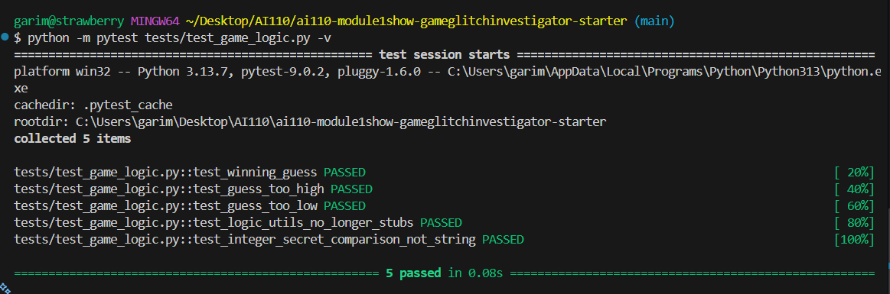

# 🎮 Game Glitch Investigator: The Impossible Guesser

## 🚨 The Situation

You asked an AI to build a simple "Number Guessing Game" using Streamlit.
It wrote the code, ran away, and now the game is unplayable. 

- You can't win.
- The hints lie to you.
- The secret number seems to have commitment issues.

## 🛠️ Setup

1. Install dependencies: `pip install -r requirements.txt`
2. Run the broken app: `python -m streamlit run app.py`

## 🕵️‍♂️ Your Mission

1. **Play the game.** Open the "Developer Debug Info" tab in the app to see the secret number. Try to win.
2. **Find the State Bug.** Why does the secret number change every time you click "Submit"? Ask ChatGPT: *"How do I keep a variable from resetting in Streamlit when I click a button?"*
In Streamlit, variables often seem to reset when you click a button because the entire script reruns from top to bottom on every user interaction. To prevent this, you should store values in st.session_state, which allows data to persist across reruns within the same user session. By first checking whether a key exists in session_state and initializing it only once, you can update and reuse that variable whenever a button is clicked without losing its value. This makes session_state the standard way to maintain counters, user inputs, lists, or any temporary app data in Streamlit apps.

3. **Fix the Logic.** The hints ("Higher/Lower") are wrong. Fix them.
4. **Refactor & Test.** - Move the logic into `logic_utils.py`.
   - Run `pytest` in your terminal.
   - Keep fixing until all tests pass!

## 📝 Document Your Experience

- [ The game's main purpose is to let the user guess the hidden numeber. In the process, it lets the users have hints for whether the hidden numeber is higher or lower than the input value. Similarly, the difficulty level of the game can be changed.] Describe the game's purpose.
- [ The "new game" button fails to redirect the user back to the home page. There are also significant issues with the game logic: the hint system is currently inverted, telling the user to go "lower" when they are below the target (e.g., at 85 for a target of 90) and "higher" when they are above it. Additionally, the "easy" mode is incorrectly configured with fewer attempts than "normal" mode. Finally, the memory system was broken, as the it keeps adding the new guesses  every time another number is added.] Detail which bugs you found.
- [ he app was updated to resolve several core logic and UI issues. Difficulty settings were rebalanced by swapping ranges (Normal: 1–50, Hard: 1–100) and increasing Easy mode to 10 attempts. The hint system was corrected to provide the right directions, and the info banner now dynamically reflects the chosen range.

On the technical side, the "New Game" function was expanded to reset score, history, and status, while an off-by-one error in the attempt counter was fixed. A critical bug involving string-based comparisons on even attempts was resolved by ensuring numeric types are used. Finally, the code was refactored by moving core functions into logic_utils.py for better testability and removing duplicate sidebar headers. ] Explain what fixes you applied. 

## 📸 Demo

- ] [Insert a screenshot of your fixed, winning game here]
#the image is uoloaded in the repo

## 🚀 Stretch Features

- [the image is uploaded in the github repo through vscode ] [If you choose to complete Challenge 4, insert a screenshot of your Enhanced Game UI here]
